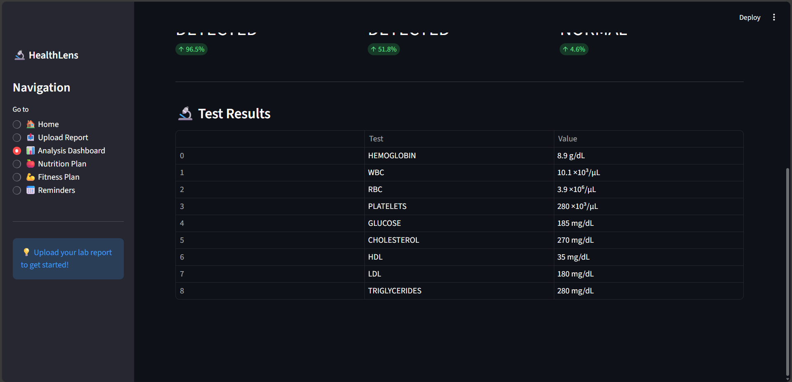
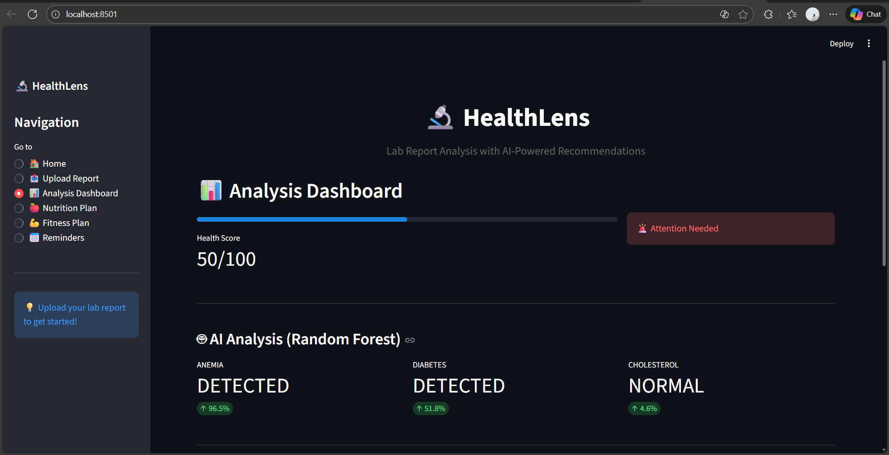
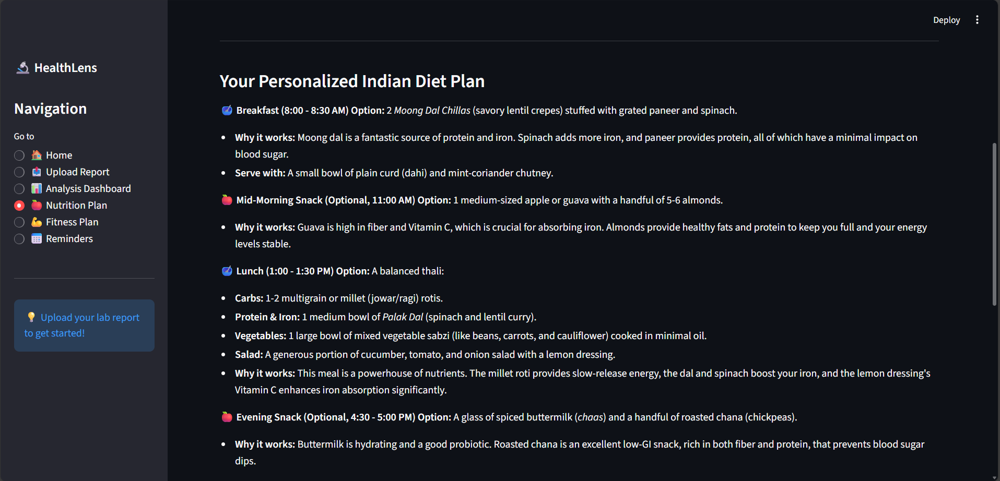

# 🔬 HealthLens — AI-Powered Lab Report Analysis

HealthLens is an AI healthcare assistant that analyzes blood test reports, detects health risks using Machine Learning, and generates personalized nutrition & fitness plans using Google Gemini — all through a Streamlit web app.

---

## 🌐 Live Demo

🚀 **Try the deployed app here:**  
🔗 [https://anushreeravichandran26-healthlens-app-xr0xsm.streamlit.app](https://anushreeravichandran26-healthlens-app-xr0xsm.streamlit.app/)

---

## 🚀 Features

- 🧾 Upload PDF / Image lab reports
- 🔍 OCR extraction of medical values
- 🤖 ML classification for Anemia, Diabetes & High Cholesterol
- 📊 Interactive health dashboard with score & insights
- 🍎 Personalized Indian diet plan (Gemini AI)
- 💪 Fitness routine based on health conditions
- ⏰ Health reminders & checkup tracking

---

## 🧠 Tech Stack

| Technology | Purpose |
|-----------|---------|
| Streamlit | Web UI |
| Python | Core backend |
| Scikit-Learn | ML Classification |
| Pandas / NumPy | Data Processing |
| Tesseract OCR | Report text extraction |
| Google Gemini | AI Recommendations |

---

## 📁 Project Structure

```
HealthLens/
├── app.py
├── requirements.txt
├── .env.example
├── data/
├── models/
├── visuals/
└── src/
    ├── ml_classifier.py
    ├── ocr_module.py
    ├── ai_recommendation.py
    └── download_datasets.py
```

---

## ⚙️ Setup Guide

### 1️⃣ Clone and open project

```sh
git clone https://github.com/AnushreeRavichandran26/HealthLens.git
cd HealthLens
```

### 2️⃣ Create & activate venv

```sh
python -m venv venv
venv\Scripts\activate   # Windows
source venv/bin/activate  # Mac/Linux
```

### 3️⃣ Install dependencies

```sh
pip install -r requirements.txt
```

### 4️⃣ Add Gemini API key

Create a `.env` file:

```ini
GEMINI_API_KEY=your_google_api_key_here
```

Get your API key from: [Google AI Studio](https://aistudio.google.com/app/apikey)

### 5️⃣ Install Tesseract OCR

**Windows:**
- Download from: [Tesseract OCR](https://github.com/UB-Mannheim/tesseract/wiki)
- Install to `C:\Program Files\Tesseract-OCR\`

**Mac:**
```sh
brew install tesseract
```

**Linux:**
```sh
sudo apt-get install tesseract-ocr
```

### 6️⃣ Download datasets & train ML models

```sh
python src/download_datasets.py --all
python src/ml_classifier.py
```

### 7️⃣ Run the web app

```sh
streamlit run app.py
```

---

## 📈 ML Model Summary

| Condition | Dataset | Target |
|-----------|---------|--------|
| Anemia | diagnosed_cbc_data_v4.csv | Hemoglobin-based |
| Diabetes | diabetes.csv | Outcome |
| Cholesterol | heart.csv | Cholesterol > 200 |

**Model:**
```
RandomForestClassifier + StandardScaler + Joblib
```

**Outputs** (saved in `visuals/`):
- Confusion Matrix
- ROC Curve
- Feature Importance

---

## 📸 Screenshots


*Dashboard showing Health Lens Home Page*




*Dashboard showing health analysis results*


*AI-generated personalized diet plan*

---

## 🛡 Disclaimer

⚠️ **This project is for educational & research purposes only and must not be used as medical advice.**

Always consult with qualified healthcare professionals for medical decisions. The AI predictions are not a substitute for professional medical diagnosis.

---


